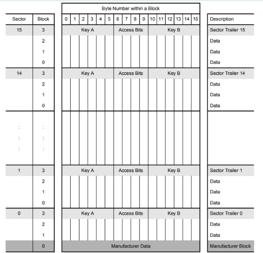
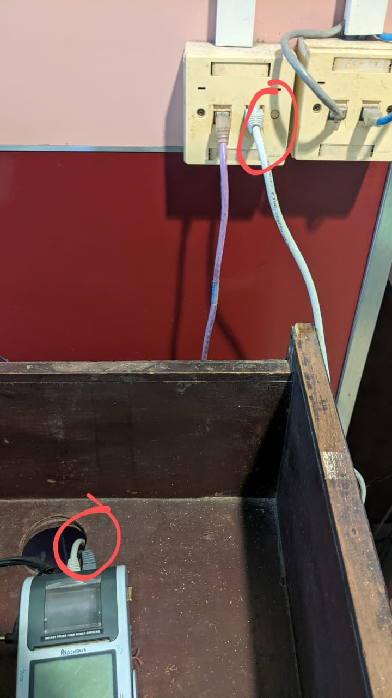

# A Brief Study on Applications of RFIDs.

### Introduction

#### **RFID**

Radio Frequency Identification is a technology which utilizes radio frequencies to transfer data.
The setup for an RFID consists of a sensor and a card/tag with rfid capabilities.

#### **RFID Cards**

RFID cards & tags have 3 main components, an Antenna, a Chip, and the substrate(the pvc card).

The chip holds all the data, and the antenna transfers and recieves signals. The antenna is a copper(or any other material) coil in a tag, or etched on the surface, in case of a card.

#### **Available Technologies**

There exist 3 types of RFID Cards: 

1. LF (low frequency) => Range {30KHz - 300KHz}
2. HF (high frequency) => Range {3 - 30MHz}
1. UHF (ultra high frequency) => Range {300MHz - 3GHz}

Cards either have an EEPROM or they are laser engraved during manufacturing.

EEPROM cards are also known as CUID(changeable UID) cards since they are modifiable electronically.

Laser Engraved cards are known as UUID(unique uid).


Usecases of Rfids, which i have encountered as a student, is typically for gaining access to a secure place, or in ticketing/transactions.

#### **Data in RFID cards**

Since there are 3 types of technologies for the cards, the data storage also varies with it.

There is 1k(classic), 2k, 4k and 8k

Currently, im in possession of only MIFARE 1K CLASSIC cards and tags.

In the classic 1k, the memory layout is as shown below:



There are 16 sectors, each sector containing 4 data blocks, and each block containing 16 bytes.
The 0th block of the 0th sector contains manufacturers data, which includes UID (first 8 bytes) and checksum(next 2 bytes.)

There are also access bits available in the mem-dumps of the cards, which can give information about the access that can be achieved with key A and key B.

Key A -> to read from the card.
Key B -> to write/read from the card.

Sample Dump:

```
Card UID: 27 D3 4F 1C
Card SAK: 08
PICC type: MIFARE 1KB
Sector Block   0  1  2  3   4  5  6  7   8  9 10 11  12 13 14 15  AccessBits
  15     63   00 00 00 00  00 00 FF 07  80 69 FF FF  FF FF FF FF  [ 0 0 1 ] 
         62   00 00 00 00  00 00 00 00  00 00 00 00  00 00 00 00  [ 0 0 0 ] 
         61   00 00 00 00  00 00 00 00  00 00 00 00  00 00 00 00  [ 0 0 0 ] 
         60   00 00 00 00  00 00 00 00  00 00 00 00  00 00 00 00  [ 0 0 0 ] 
  14     59   00 00 00 00  00 00 FF 07  80 69 FF FF  FF FF FF FF  [ 0 0 1 ] 
         58   00 00 00 00  00 00 00 00  00 00 00 00  00 00 00 00  [ 0 0 0 ] 
         57   00 00 00 00  00 00 00 00  00 00 00 00  00 00 00 00  [ 0 0 0 ] 
         56   00 00 00 00  00 00 00 00  00 00 00 00  00 00 00 00  [ 0 0 0 ] 
  13     55   00 00 00 00  00 00 FF 07  80 69 FF FF  FF FF FF FF  [ 0 0 1 ] 
         54   00 00 00 00  00 00 00 00  00 00 00 00  00 00 00 00  [ 0 0 0 ] 
         53   00 00 00 00  00 00 00 00  00 00 00 00  00 00 00 00  [ 0 0 0 ] 
         52   00 00 00 00  00 00 00 00  00 00 00 00  00 00 00 00  [ 0 0 0 ] 
  12     51   00 00 00 00  00 00 FF 07  80 69 FF FF  FF FF FF FF  [ 0 0 1 ] 
         50   00 00 00 00  00 00 00 00  00 00 00 00  00 00 00 00  [ 0 0 0 ] 
         49   00 00 00 00  00 00 00 00  00 00 00 00  00 00 00 00  [ 0 0 0 ] 
         48   00 00 00 00  00 00 00 00  00 00 00 00  00 00 00 00  [ 0 0 0 ] 
  11     47   00 00 00 00  00 00 FF 07  80 69 FF FF  FF FF FF FF  [ 0 0 1 ] 
         46   00 00 00 00  00 00 00 00  00 00 00 00  00 00 00 00  [ 0 0 0 ] 
         45   00 00 00 00  00 00 00 00  00 00 00 00  00 00 00 00  [ 0 0 0 ] 
         44   00 00 00 00  00 00 00 00  00 00 00 00  00 00 00 00  [ 0 0 0 ] 
  10     43   00 00 00 00  00 00 FF 07  80 69 FF FF  FF FF FF FF  [ 0 0 1 ] 
         42   00 00 00 00  00 00 00 00  00 00 00 00  00 00 00 00  [ 0 0 0 ] 
         41   00 00 00 00  00 00 00 00  00 00 00 00  00 00 00 00  [ 0 0 0 ] 
         40   00 00 00 00  00 00 00 00  00 00 00 00  00 00 00 00  [ 0 0 0 ] 
   9     39   00 00 00 00  00 00 FF 07  80 69 FF FF  FF FF FF FF  [ 0 0 1 ] 
         38   00 00 00 00  00 00 00 00  00 00 00 00  00 00 00 00  [ 0 0 0 ] 
         37   00 00 00 00  00 00 00 00  00 00 00 00  00 00 00 00  [ 0 0 0 ] 
         36   00 00 00 00  00 00 00 00  00 00 00 00  00 00 00 00  [ 0 0 0 ] 
   8     35   00 00 00 00  00 00 FF 07  80 69 FF FF  FF FF FF FF  [ 0 0 1 ] 
         34   00 00 00 00  00 00 00 00  00 00 00 00  00 00 00 00  [ 0 0 0 ] 
         33   00 00 00 00  00 00 00 00  00 00 00 00  00 00 00 00  [ 0 0 0 ] 
         32   00 00 00 00  00 00 00 00  00 00 00 00  00 00 00 00  [ 0 0 0 ] 
   7     31   00 00 00 00  00 00 FF 07  80 69 FF FF  FF FF FF FF  [ 0 0 1 ] 
         30   00 00 00 00  00 00 00 00  00 00 00 00  00 00 00 00  [ 0 0 0 ] 
         29   00 00 00 00  00 00 00 00  00 00 00 00  00 00 00 00  [ 0 0 0 ] 
         28   00 00 00 00  00 00 00 00  00 00 00 00  00 00 00 00  [ 0 0 0 ] 
   6     27   00 00 00 00  00 00 FF 07  80 69 FF FF  FF FF FF FF  [ 0 0 1 ] 
         26   00 00 00 00  00 00 00 00  00 00 00 00  00 00 00 00  [ 0 0 0 ] 
         25   00 00 00 00  00 00 00 00  00 00 00 00  00 00 00 00  [ 0 0 0 ] 
         24   00 00 00 00  00 00 00 00  00 00 00 00  00 00 00 00  [ 0 0 0 ] 
   5     23   00 00 00 00  00 00 FF 07  80 69 FF FF  FF FF FF FF  [ 0 0 1 ] 
         22   00 00 00 00  00 00 00 00  00 00 00 00  00 00 00 00  [ 0 0 0 ] 
         21   00 00 00 00  00 00 00 00  00 00 00 00  00 00 00 00  [ 0 0 0 ] 
         20   00 00 00 00  00 00 00 00  00 00 00 00  00 00 00 00  [ 0 0 0 ] 
   4     19   00 00 00 00  00 00 FF 07  80 69 FF FF  FF FF FF FF  [ 0 0 1 ] 
         18   00 00 00 00  00 00 00 00  00 00 00 00  00 00 00 00  [ 0 0 0 ] 
         17   00 00 00 00  00 00 00 00  00 00 00 00  00 00 00 00  [ 0 0 0 ] 
         16   00 00 00 00  00 00 00 00  00 00 00 00  00 00 00 00  [ 0 0 0 ] 
   3     15   00 00 00 00  00 00 FF 07  80 69 FF FF  FF FF FF FF  [ 0 0 1 ] 
         14   00 00 00 00  00 00 00 00  00 00 00 00  00 00 00 00  [ 0 0 0 ] 
         13   00 00 00 00  00 00 00 00  00 00 00 00  00 00 00 00  [ 0 0 0 ] 
         12   00 00 00 00  00 00 00 00  00 00 00 00  00 00 00 00  [ 0 0 0 ] 
   2     11   00 00 00 00  00 00 FF 07  80 69 FF FF  FF FF FF FF  [ 0 0 1 ] 
         10   00 00 00 00  00 00 00 00  00 00 00 00  00 00 00 00  [ 0 0 0 ] 
          9   00 00 00 00  00 00 00 00  00 00 00 00  00 00 00 00  [ 0 0 0 ] 
          8   00 00 00 00  00 00 00 00  00 00 00 00  00 00 00 00  [ 0 0 0 ] 
   1      7   00 00 00 00  00 00 FF 07  80 69 FF FF  FF FF FF FF  [ 0 0 1 ] 
          6   00 00 00 00  00 00 00 00  00 00 00 00  00 00 00 00  [ 0 0 0 ] 
          5   00 00 00 00  00 00 00 00  00 00 00 00  00 00 00 00  [ 0 0 0 ] 
          4   00 00 00 00  00 00 00 00  00 00 00 00  00 00 00 00  [ 0 0 0 ] 
   0      3   00 00 00 00  00 00 FF 07  80 69 FF FF  FF FF FF FF  [ 0 0 1 ] 
          2   00 00 00 00  00 00 00 00  00 00 00 00  00 00 00 00  [ 0 0 0 ] 
          1   00 00 00 00  00 00 00 00  00 00 00 00  00 00 00 00  [ 0 0 0 ] 
          0   27 D3 4F 1C  A7 08 04 00  62 63 64 65  66 67 68 69  [ 0 0 0 ] 
```

The UID could also be related to the ID number given on all the cards, since the cards could not have been distributed randomly.


> There is a vulnerability in the Classic cards, which lies in the encryption algorithm which is used for these cards => `crypto-1`.

I haven't explored it yet, but it is related to the feedback of shift-registers.

#### **Flaws in RFID Access**

In my university, the RFID cards provided are empty, there is no data stored in the RFID cards except the UID part, yet they still work for gaining access to secure places.

Using an RFID with a different UID(not registered with the university) does not work. So the Sensors must be programmed to just check the 0th block and verify it with the DB which is being used.

Need to explore this area.

#### **Flaws in RFID Ticketing/Transactions**

The Cafeteria/Food Courts in my University use a POS(point of service) machine, namely [VisionTek GL14-POS](https://www.visiontek.co.in/transaction-terminals/GL-14.html).

But again, the cards issued by the university are empty, having no data whatsoever, except the stock entries and UID(manufacturers data).

Also, the POS machine has 256 mb of flash memory, and the cards issued by the food court cannot be used anywhere else.
So there exists 2 possibilities -> either the pos machine is checking data off of a sever hosted by the university, or the data is stored locally.

However, the machine has 2 connection:



Grey Cable -> Serial Port
White Cable -> RJ45

I need to verify if an EEPROM card(CUID) with the UID of another students card will work, since it will confirm the gaping flaw in the system, since we're dealing with actual money with which students buy food.

The next thing needed to be verified is if the data is being stored locally or being hosted on a local server, because if the data is being stored locally, it is a very big vulnerability, as the loss of even 30-40% of data can cause a mob(lol).


### My Setup:

My setup to scan RFIDs is extremely simple.
Im using an Arduino Uno R3, standard RFID Sensor for arduinos (RC522) and example libraries to read the mem-dumps to analyze how data has been written on rfids in my university.


### Sources: 

[RFId Range Data](https://www.impinj.com/products/technology/how-can-rfid-systems-be-categorized#:~:text=High%2DFrequency%20(HF)%20RFID,payment%2C%20and%20data%20transfer%20applications.)

[MIFARE 1k Classic Datasheet](https://www.nxp.com/docs/en/data-sheet/MF1S50YYX_V1.pdf)

[DEFCON hacking conference on rfids](https://infocon.org/cons/DEF%20CON/DEF%20CON%2026/DEF%20CON%2026%20workshops/DEFCON-26-Workshop-Vinnie-Vanhoecke-and-Lorenzo-Bernardi-Playing-With-RFID/DEF%20CON%2026%20-%20Workshop-Vinnie-Vanhoecke-and-Lorenzo-Bernardi-Playing-With-RFID-Theory.pdf)
