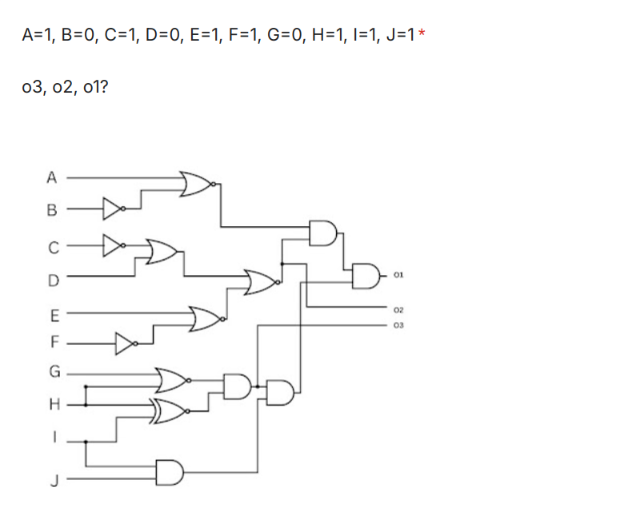
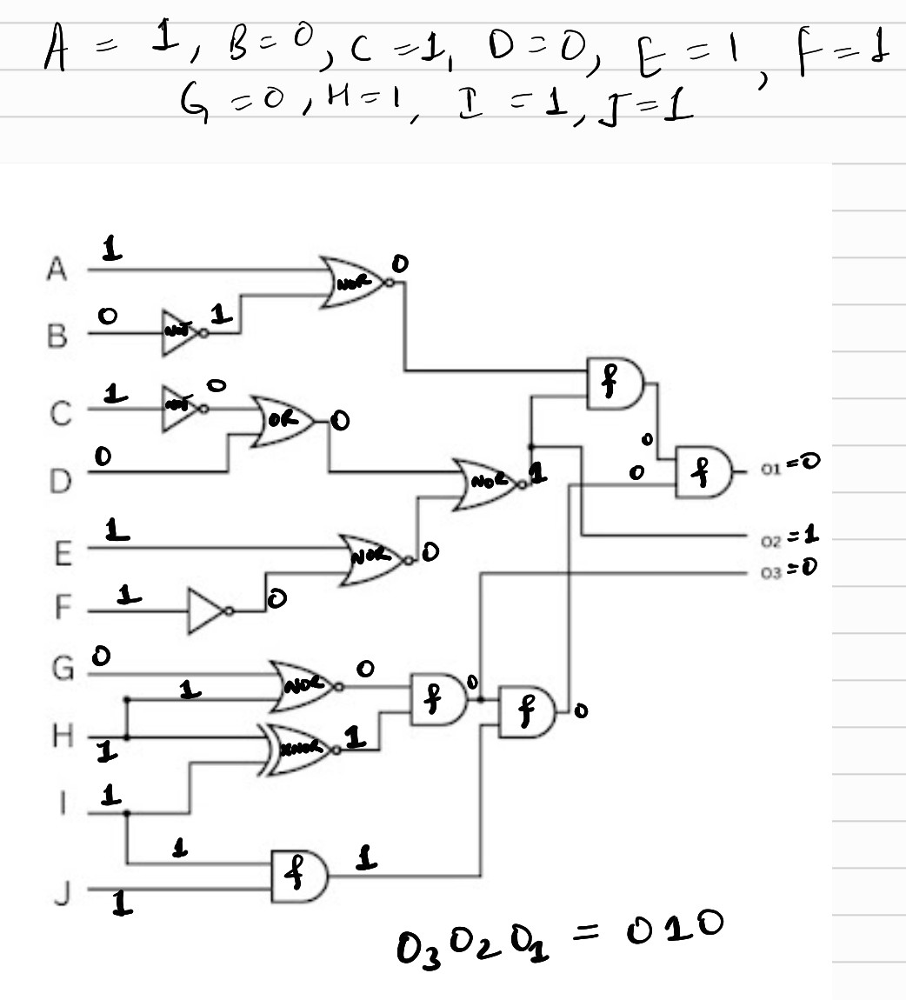
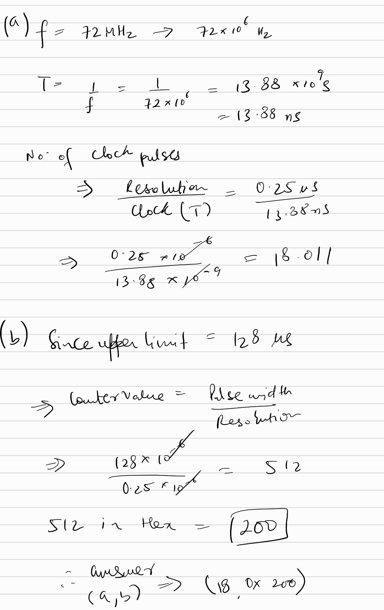

# Hardware TaskPhase Mandatory questions

### Q1
#### A device you are inspecting works with 5v logic levels. You need to measure the pulse width of one of the output signals, but the microcontroller you are handed works on 3.3v logic levels. What resistor combination do you use do extract 3.3v out of 5v. (Resistor combination and resistor to tap voltage out off).

My solution:

Using the voltage divider formula:

Vout = Vin((R2)/(R1+R2))

answer comes out to be => r2 ~= 1k ohm & r1 ~= 0.5k ohm

### Q2

Ans => 010

My solution:

### Q3
#### The given microcontroller is adjusted to work at a clock speed of 72 MHz. You need to use the input capture of this microcontroller to measure the pulse width given to it with a resolution of 0.25 micro second. After how many clock pulses do you increment the time counter by 1 to achieve this (a)? It is also observed that the pulse width varies from 64 micro seconds to 128 microseconds. The time counter resets after reaching a certain value. What should be the minimum value of the counter at which it resets to cover the range (b in hex)? (a, b)

Answer => (18, 0x200)

My solution:

### Q4

#### You are inspecting a UART signal. To be able to read the UART data, the device reading it must know the speed of the incoming signal in terms of a value called Baud rate (bits per second). Many industry standard devices set common baud rates like 9600 and 115200 but on applying the same settings for your signal, you do not get an error free reading. Explain what you would do in this situation to correctly identify the custom baud rate of the signal and read the data, given that you have the needed software to inspect several factors of the signal such as timing(pulse width) and voltage levels.

My answer:

The mathematical definition of baudrate is signal changes per second.
another formula for baudrate is => `1/Time(smallest bit)`, just like `f=1/T`.
therefore, this approach will give the 'custom' baudrate for the signal.
