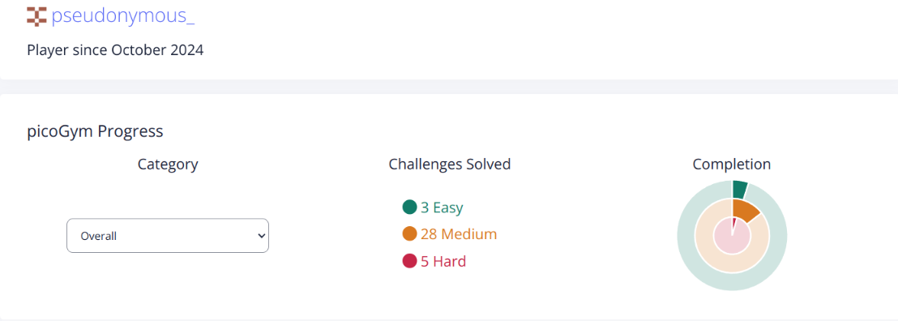

# picoCTF_cryptonite-tp2

| Domain | total-chals |extra-chals |
| :---:         |     :---:      |          :---: |
| Forensics   | 17     | 14    |
| BinExp{pwn}     | 10       | 7      |
| Rev Engg.   | 3     | 0    |
| Cryptography     | 3       | 0      |
| WebExp   | 3     | 0    |

| all-domains | total-chals |extra-chals |
| :---:         |     :---:      |          :---: |
| Forensics   | 36     | 21    |

### graph

