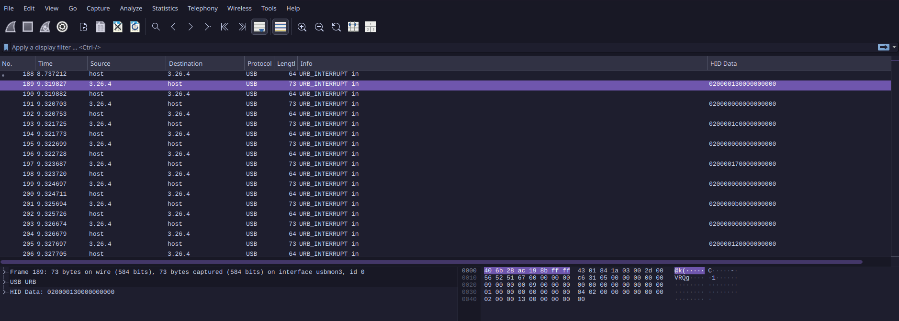
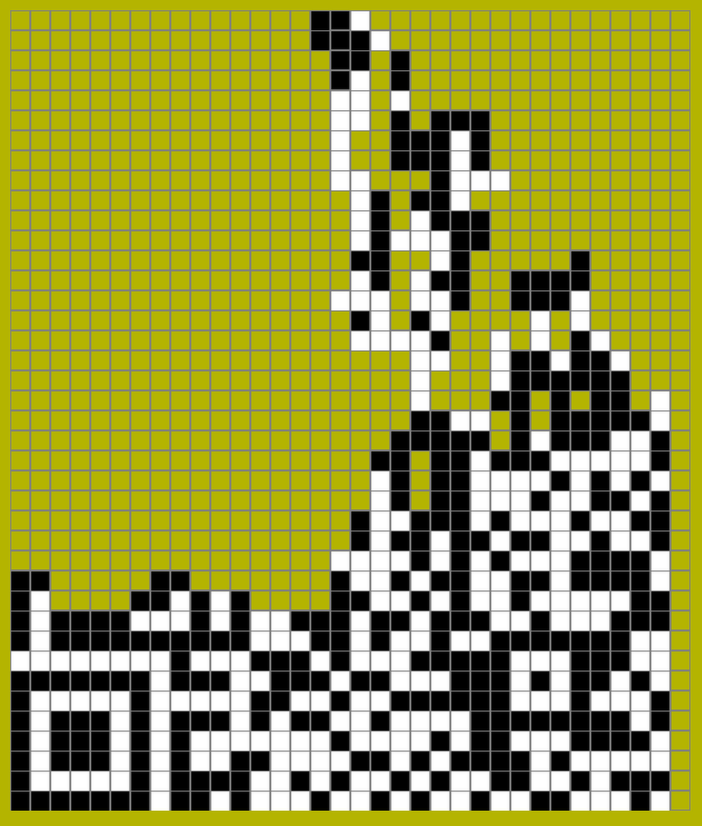
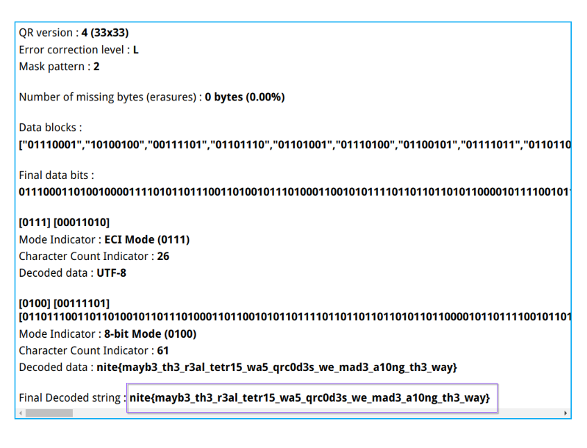

## Tet-riffic

Flag: `nite{mayb3_th3_r3al_tetr15_wa5_qrc0d3s_we_mad3_a10ng_th3_way}`

In this challenge, we were initially provided a .pcapng file, and a python file(tetris pygame). I got a little confused at first, but after fiddling around with the game and the .pcapng file, i realized that .pcapng file contained USB interrupts, and it was related to a keyboard(plugging in and out)

So I looked for the first character that contained HID data(the information sent by keyboard when a key is pressed).



I filtered out the HID data(which was in hex) using python and gave it as a stdout to a text file.

The [hex data](assets/hexd.txt) contained over 6k lines.

head:

```
020000130000000000
020000000000000000
0200001c0000000000
020000000000000000
020000170000000000
020000000000000000
0200000b0000000000
020000000000000000
020000120000000000
020000000000000000
```


Then using python(i did not write the script, got it off the internet), converted HID -> string and got an output as ``` w a w a space``` etc.
[script](assets/script.py)

This was the [output](assets/flag.txt) from the script, which i converted to a [single string](assets/output.txt).


Error correction, qr code => L2

qr version => 33x33(v.4)

this was the output from the pygame file(i commented out the "game over" lines to get the complete picture so i could import it in https://merri.cx/qrazybox/ but it did not work.)



I had to manually edit the qr and after fixing it, i got the flag.



## und3rC0VEr {miscellaneous}

Flag: `nite{pwn_m3_d4ddy}`

In this challenge, by reading the chal_desc, i understood that a network block device was involved, since there file provided in the challenge was a vmdk(basically a fake hdd for an os within a virtual machine).

info: [NBD](https://docs.kernel.org/admin-guide/blockdev/nbd.html) => used to access remote storage, which is not physically in the system. it can be used to remote backups/snapshots etc.
nbd sends a request over to TCP, which replies with the data read.

```
# modprobe nbd max_part=8

# qemu-nbd --connect=/dev/nbd0 router-disk1.vmdk 

Disk /dev/nbd0: 8 GiB, 8589934592 bytes, 16777216 sectors
Units: sectors of 1 * 512 = 512 bytes
Sector size (logical/physical): 512 bytes / 512 bytes
I/O size (minimum/optimal): 512 bytes / 512 bytes
Disklabel type: dos
Disk identifier: 0xf7f52f51

# fdisk -l /dev/nbd0

Device       Boot   Start      End  Sectors  Size Id Type
/dev/nbd0p1          2048     4095     2048    1M 83 Linux
/dev/nbd0p2          4096    73727    69632   34M 83 Linux
/dev/nbd0p3         73728   143359    69632   34M 83 Linux
/dev/nbd0p4        143360 16777215 16633856  7.9G  f W95 Ext'd (LBA)
/dev/nbd0p5        145408  4339711  4194304    2G 83 Linux
/dev/nbd0p6       4341760  4351999    10240    5M 83 Linux
/dev/nbd0p7       4354048  4364287    10240    5M 83 Linux
/dev/nbd0p8       4366336  4376575    10240    5M 83 Linux
/dev/nbd0p9       4378624  4388863    10240    5M 83 Linux
/dev/nbd0p10      4390912  4399103     8192    4M 83 Linux
/dev/nbd0p11      4401152 16777215 12376064  5.9G 83 Linux


```

now, my first thought was to mount nbd0p4, and then explore the files to get the password.
but i couldnt mount the device.
{in dmesg => `[140195.983337] EXT4-fs (nbd0p4): unable to read superblock`}

so i ran `# strings /dev/nbd0 | grep password` 

and got the output =>

```
<Property oe:key="com.cisco.csr1000v.login-password.1" oe:value="pwn_m3_d4ddy"/>
<Property oe:key="com.cisco.csr1000v.login-password.1" oe:value="pwn_m3_d4ddy"/>
<Property oe:key="com.cisco.csr1000v.login-password.1" oe:value="pwn_m3_d4ddy"/>
<Property oe:key="com.cisco.csr1000v.login-password.1" oe:value="pwn_m3_d4ddy"/>
<Property oe:key="com.cisco.csr1000v.login-password.1" oe:value="pwn_m3_d4ddy"/>
<Property oe:key="com.cisco.csr1000v.login-password.1" oe:value="pwn_m3_d4ddy"/>
<Property oe:key="com.cisco.csr1000v.login-password.1" oe:value="pwn_m3_d4ddy"/>
password_pbkdf2.mod
password.modb
legacy_password_test.mod
Enter ZFS password: 
grub_password_get
password
passwordPASSWORDpassword
invalid PBKDF2 password
password_pbkdf2
Set user password (PBKDF2). 
password_pbkdf2
password
Set user password (plaintext). Unrecommended and insecure.
password
grub_normal_set_password
Enter password: 
grub_password_get
grub_password_get
Enter password: 
legacy_password
Simulate grub-legacy `password' command
legacy_check_password
Simulate grub-legacy `password' command in menu entry mode
password
legacy_password %s '%s'
If used in the first section of a menu file, disable all interactive editing control (menu entry editor and command line). If the password PASSWD is entered, it loads the FILE as a new config file and restarts the GRUB Stage 2. If you omit the argument FILE, then GRUB just unlocks privileged instructions.  You can also use it in the script section, in which case it will ask for the password, before continuing. The option --md5 tells GRUB that PASSWD is encrypted with md5crypt.
if legacy_check_password %s '%s'; then configfile '%s'; else return; fi
if ! legacy_check_password %s '%s'; then return fi;
password
grub_normal_set_password
grub_password_get
grub_legacy_check_md5_password
legacy_password_test
Bad password check (%d)
grub_legacy_check_md5_password (vectors[i].argc, vectors[i].args, vectors[i].entered) == vectors[i].exp
tests/legacy_password_test.c
legacy_password_test
legacy_password_test
grub_legacy_check_md5_password
grub_password_get
legacy_password_test
grub_password_get
password_pbkdf2: crypto gcry_sha512 pbkdf2 normal
legacy_password_test: functional_test legacycfg
password: crypto normal
legacycfg: linux crypto password gcry_md5 normal
legacy_check_password: legacycfg
legacy_password: legacycfg
password: password
password_pbkdf2: password_pbkdf2
^[[AProperty key="com.cisco.csr1000v.login-password.1" value=<redacted>
...generated 'username ... password...' command
Property key="com.cisco.csr1000v.login-password.1" value=<redacted>
...generated 'username ... password...' command
```

since the password => `pwn_m3_d4ddy`

the flag is self explanatory. 


