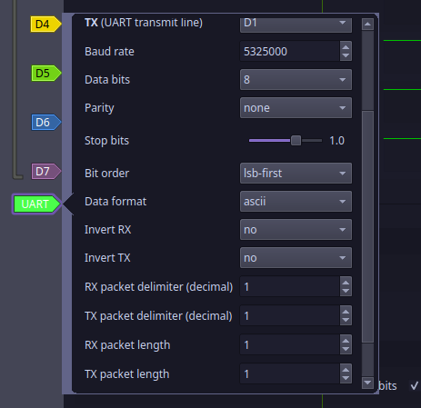

## U ARe T Detective

Flag: ```nite{n0n_std_b4ud_r4t3s_ftw}```

In this chall, we were given a .sr(serial record) file, and from the name, it seems obvious that a UART protocol is being implemented. 
So, i opened up the .sr file in a logic analyzer and added a row for UART. 

I tried standard baudrates(bits per sec), like 4800, 9600 etc but none of them worked.

since ```baudrate = 1/T(smallest bit)``` like ```f = 1/t``` in UART, i calculated baudrate to be equal to 5.3254Mhz.

here is my UART config.


This was the final output.
```
30044586-30044610 UART: RX packets: n
30044942-30044966 UART: RX packets: i
30045205-30045229 UART: RX packets: t
30045467-30045491 UART: RX packets: e
30045729-30045753 UART: RX packets: {
30045991-30046015 UART: RX packets: n
30046253-30046277 UART: RX packets: 0
30046515-30046539 UART: RX packets: n
30046777-30046801 UART: RX packets: _
30047039-30047063 UART: RX packets: s
30047301-30047325 UART: RX packets: t
30047563-30047587 UART: RX packets: d
30047825-30047849 UART: RX packets: _
30048087-30048111 UART: RX packets: b
30048350-30048374 UART: RX packets: 4
30048612-30048636 UART: RX packets: u
30048874-30048898 UART: RX packets: d
30049136-30049160 UART: RX packets: _
30049398-30049422 UART: RX packets: r
30049660-30049684 UART: RX packets: 4
30049922-30049946 UART: RX packets: t
30050184-30050208 UART: RX packets: 3
30050446-30050470 UART: RX packets: s
30050708-30050732 UART: RX packets: _
30050970-30050994 UART: RX packets: f
30051232-30051256 UART: RX packets: t
30051494-30051518 UART: RX packets: w
30051757-30051781 UART: RX packets: }
```

