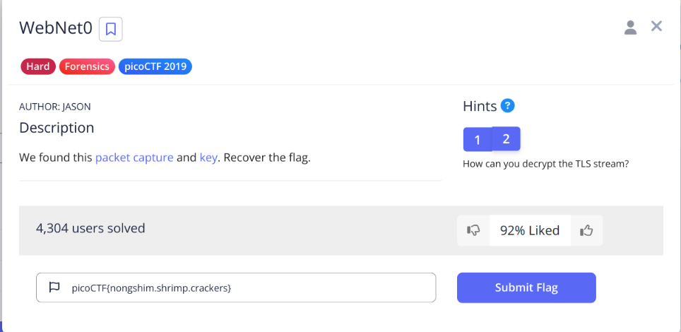
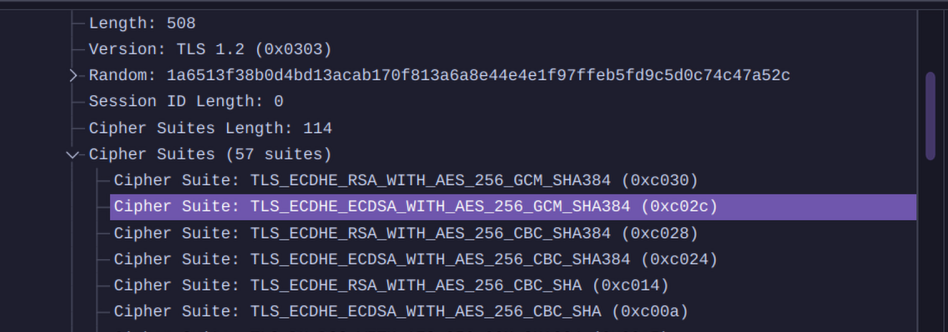
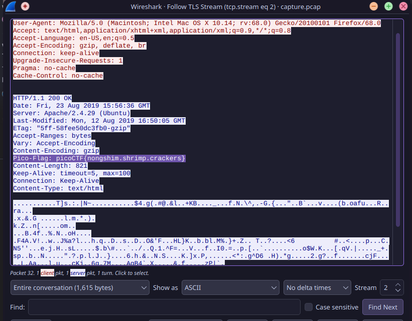
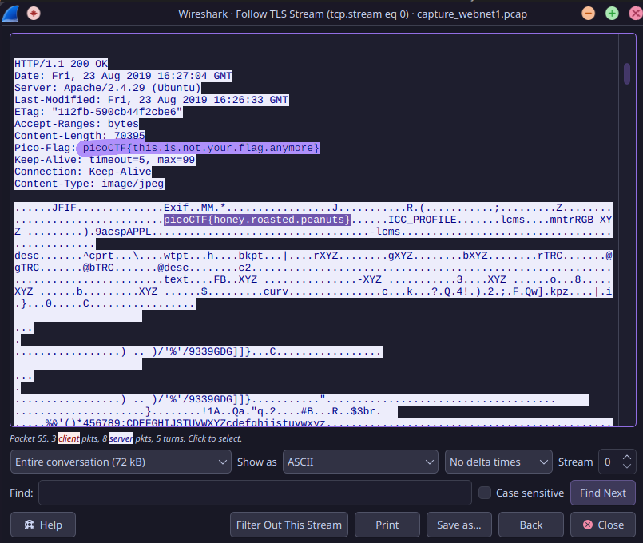
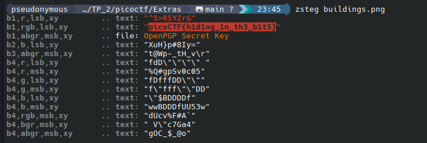
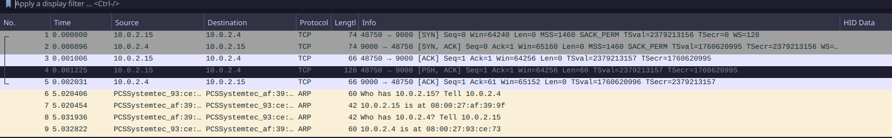
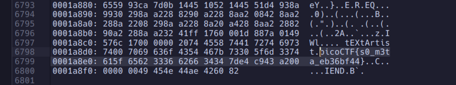

## Trivial Flag Transfer Protocol

Flag: ```picoCTF{h1dd3n_1n_pLa1n_51GHT_18375919}```

Hints used: NONE

This challenge was a long one, especially for me since i'm not that well versed with networking terms, like TFTP.
So it took a lot of research to understand what i had to do in this chal.

I started with installing wireshark, since it is the standard software for opening .pcapang files.

after that, i went to the TFTP column and found 6 files, which i extracted and downloaded.

Instructions.txt: ```GSGCQBRFAGRAPELCGBHEGENSSVPFBJRZHFGQVFTHVFRBHESYNTGENAFSRE.SVTHERBHGNJNLGBUVQRGURSYNTNAQVJVYYPURPXONPXSBEGURCYNA```

Went to https://dcode.fr/en/ and used cipher identifier to check what encryption method was used. ROT13 is being used here.

decrypted text: ```TFTP DOESNT ENCRYPT OUR TRAFFIC SO WE MUST DISGUISE OUR FLAG TRANSFER.FIGURE OUT A WAY TO HIDE THE FLAG AND I WILL CHECK BACK FOR THE PLAN```

opened Plan.txt: ```VHFRQGURCEBTENZNAQUVQVGJVGU-QHRQVYVTRAPR.PURPXBHGGURCUBGBF```

decrypted text: ```I USED THE PROGRAM AND HID IT WITH-DUEDILIGENCE.CHECK OUT THE PHOTOS```

Now, i tried to open the .deb file, but since i use arch btw, i just extracted the .deb file and found it was pkg for [steghide](/TP_2/chal_assets/TFTP/program/control/control).

i installed the pgk using yay, and ran some commands(image attacted below) to get the flag

Also, i figured that the passphrase should be DUEDILIGENCE since there was no other option.


## tunn3l_v1s10n

Flag: ```picoCTF{qu1t3_a_v13w_2020}```

Hints Used: NONE

This challenge was extremely straightforward,
i ran ```xxd -l 0x40 tunn3l_v1s10n``` to get the first 4 lines of hexdump, which made it clear that i had to mess with the header file and pixel size data of the .BMP(windows bitmap) file.

The following image shows the data i edited.


The flag is attached below.


## m00nwalk

Flag: ```picoCTF{beep_boop_im_in_space}```

Hints Used: 1 & 2

This challenge was a little complicated, due to all the packages involved to get the flag.

It was clear from the hint 1 that we need to decode the .wav file using SSTV(slow scan tv) protocol. To decode this,
i installed around 3 packages related to sstv(slowrx, sstv, qsstv), out of which only qsstv worked.

Now, to give the input .wav, i tried adding the .wav direcly instead of taking input from the sound card, but
that did not work, maybe due to some error in the application.

So, i made a virtual audio channel and played the ```message.wav``` file via the channel.

i used ```pavucontrol``` as the audio server.

Here are the commands used(for giving the input):

```
pactl load-module module-null-sink sink_name=virtual-cable
paplay -d virtual-cable message.wav
```
For cleanup: 
```
>>pactl list short modules
1       libpipewire-module-rt   {
            nice.level    = -11
            rt.prio       = 88
            #rt.time.soft = -1
            #rt.time.hard = -1
            #uclamp.min = 0
            #uclamp.max = 1024
        }
2       libpipewire-module-protocol-native      {
            # List of server Unix sockets, and optionally permissions
            #sockets = [ { name = "pipewire-0" }, { name = "pipewire-0-manager" } ]
        }
4       libpipewire-module-profiler
6       libpipewire-module-metadata
8       libpipewire-module-spa-device-factory
10      libpipewire-module-spa-node-factory
12      libpipewire-module-client-node
14      libpipewire-module-client-device
16      libpipewire-module-portal
17      libpipewire-module-access       {
            # Socket-specific access permissions
            #access.socket = { pipewire-0 = "default", pipewire-0-manager = "unrestricted" }

            # Deprecated legacy mode (not socket-based),
            # for now enabled by default if access.socket is not specified
            #access.legacy = true
        }
18      libpipewire-module-adapter
20      libpipewire-module-link-factory
22      libpipewire-module-session-manager
536870912       module-always-sink
536870913       module-device-manager
536870914       module-device-restore
536870915       module-stream-restore
536870916       module-null-sink        sink_name=virtual-cable

>>pactl unload-module 536870916

pseudonymous  …/cryptonite_taskphase_aryan/TP_2/chal_assets   main !?    v14.2.1  00:48  pactl list short modules1       libpipewire-module-rt   {
            nice.level    = -11
            rt.prio       = 88
            #rt.time.soft = -1
            #rt.time.hard = -1
            #uclamp.min = 0
            #uclamp.max = 1024
        }
2       libpipewire-module-protocol-native      {
            # List of server Unix sockets, and optionally permissions
            #sockets = [ { name = "pipewire-0" }, { name = "pipewire-0-manager" } ]
        }
4       libpipewire-module-profiler
6       libpipewire-module-metadata
8       libpipewire-module-spa-device-factory
10      libpipewire-module-spa-node-factory
12      libpipewire-module-client-node
14      libpipewire-module-client-device
16      libpipewire-module-portal
17      libpipewire-module-access       {
            # Socket-specific access permissions
            #access.socket = { pipewire-0 = "default", pipewire-0-manager = "unrestricted" }

            # Deprecated legacy mode (not socket-based),
            # for now enabled by default if access.socket is not specified
            #access.legacy = true
        }
18      libpipewire-module-adapter
20      libpipewire-module-link-factory
22      libpipewire-module-session-manager
536870912       module-always-sink
536870913       module-device-manager
536870914       module-device-restore
536870915       module-stream-restore
```

Following files are attached which are the output of the decoding.


# EXTRA CHALS

## WebNet0{HARD}

Flag: ```picoCTF{nongshim.shrimp.crackers}```

Hints Used: 2



In this chall, i was given a .pcapng file, and after opening the file in wireshark, i understood it had some data related to the TLS Protocol {transport layer security is a cryptographic protocol that essentially safeguards the communication b/w a server and user on the internel}.

After examining it further, i got to know that there was an RSA-AES encryption.


Since the key was provided in the challenge, i added the key in preferences, under the TLS protocol section.

After giving it the key, the screen refreshed and instead of TLSv1.2, i got HTTP protocol in a few columns, and upon opening the dump for GET request, i got the flag.


## WebNet1{HARD}

Flag: ```picoCTF{honey.roasted.peanuts}```

Hints Used: NONE

Similar to the last challenge, i had a different .pcapng file and a key, but this time, the flag was not in the GET request. So after opening different requests, i spotted the flag in ```GET /vulture.jpg HTTP/1.1```.



## WhitePages {MEDIUM}

Flag: ```picoCTF{not_all_spaces_are_created_equal_3e2423081df9adab2a9d96afda4cfad6}```

Hints Used: NONE

In this challenge, i was given a file, which contained only whitespaces.

So initially, i ran ```file whitespaces.txt``` which gave me the output
```whitepages.txt: Unicode text, UTF-8 text, with very long lines (1376), with no line terminators```

After that, i tried to get the hexdump for file by running ```xxd whitespaces.txt > HEXD_WHITE.txt```

```
00000000: e280 83e2 8083 e280 83e2 8083 20e2 8083  ............ ...
00000010: 20e2 8083 e280 83e2 8083 e280 83e2 8083   ...............
00000020: 20e2 8083 e280 8320 e280 83e2 8083 e280   ...... ........
00000030: 83e2 8083 20e2 8083 e280 8320 e280 8320  .... ...... ... 
00000040: 2020 e280 83e2 8083 e280 83e2 8083 e280    ..............
00000050: 8320 20e2 8083 20e2 8083 e280 8320 e280  .  ... ...... ..
00000060: 8320 20e2 8083 e280 83e2 8083 2020 e280  .  .........  ..
00000070: 8320 20e2 8083 2020 2020 e280 8320 e280  .  ...    ... ..
00000080: 83e2 8083 e280 83e2 8083 2020 e280 8320  ..........  ... 
00000090: e280 8320 e280 8320 e280 83e2 8083 e280  ... ... ........
000000a0: 8320 e280 83e2 8083 e280 8320 20e2 8083  . .........  ...
```

In the hexdump, it was quite clear that only 2 strings were being repeated.
```0x20``` which is the code for standard space, and ```0xe2\0x80\0x83```. since there are 2 options i approached the chal by taking them as binary chars. after taking ```0x20``` as 0, i got the following output.

```b'\n\t\tpicoCTF\n\n\t\tSEE PUBLIC RECORDS & BACKGROUND REPORT\n\t\t5000 Forbes Ave, Pittsburgh, PA 15213\n\t\tpicoCTF{not_all_spaces_are_created_equal_3e2423081df9adab2a9d96afda4cfad6}\n\t\t'```

## extensions {MEDIUM}

Flag:```picoCTF{now_you_know_about_extensions}```

Hints Used: NONE

pretty easy chall, the file was given as flag.txt.
changing the extension from flag.txt -> flag.png gave me the flag.


## What Lies Within {MEDIUM}

Flag: ```picoCTF{h1d1ng_1n_th3_b1t5}```

Hints Used: NONE

In this challenge, i had a normal looking .png file. so the first thing i did was get the hexdump of the png but the header and the ending was correct. so i googled online for different steganography methods, and came across LSB Steganography, where the least significant bit is replaced with the message to be hidden.

so i used ```zsteg``` package to check for hidden data and got the flag.



## Packets Primer {MEDIUM}

Flag: ```picoCTF{p4ck37_5h4rk_b9d53765}```

Hints Used: NONE

for this challenge, we were provied a .pcap file which had some data on the TCP(transmission control protocol) stream and some data on the Ethernet/ARP stream.

I wasted a lot of time on the Ethernet data since there was some text in the info, which was readable and made sense.


Eventually i realized there was nothing there, and then i followed the TCP stream which gave me the flag instantly. 


To get rid of the whitespace, i wrote a small python script.

```
b = "p i c o C T F { p 4 c k 3 7 _ 5 h 4 r k _ b 9 d 5 3 7 6 5 }"

x = ''.join(b.split())

print(x)
```

## So Meta {MEDIUM}

Flag: ```picoCTF{s0_m3ta_eb36bf44}```

Hints Used: NONE

So apparently to solve this challenge, there are 2 methods

#### Method 1

This is the method i used.
ran ```xxd pico_img.png > hexd_pico.txt``` to get the hexdump of the image.

The flag was at the end of the hex_dump.


#### Method 2

This was the method i found online, there exists a tool named ```exiftool``` which can provided information about a file, including meta data.

Unfortunately, i couldn't install the package on arch, no mirrors were available.


