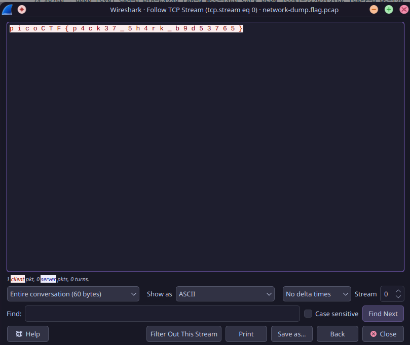

## Trivial Flag Transfer Protocol

Flag: ```picoCTF{h1dd3n_1n_pLa1n_51GHT_18375919}```

Hints used: NONE

This challenge was a long one, especially for me since i'm not that well versed with networking terms, like TFTP.
So it took a lot of research to understand what i had to do in this chal.

I started with installing wireshark, since it is the standard software for opening .pcapang files.

after that, i went to the TFTP column and found 6 files, which i extracted and downloaded.

Instructions.txt: ```GSGCQBRFAGRAPELCGBHEGENSSVPFBJRZHFGQVFTHVFRBHESYNTGENAFSRE.SVTHERBHGNJNLGBUVQRGURSYNTNAQVJVYYPURPXONPXSBEGURCYNA```

Went to https://dcode.fr/en/ and used cipher identifier to check what encryption method was used. ROT13 is being used here.

decrypted text: ```TFTP DOESNT ENCRYPT OUR TRAFFIC SO WE MUST DISGUISE OUR FLAG TRANSFER.FIGURE OUT A WAY TO HIDE THE FLAG AND I WILL CHECK BACK FOR THE PLAN```

opened Plan.txt: ```VHFRQGURCEBTENZNAQUVQVGJVGU-QHRQVYVTRAPR.PURPXBHGGURCUBGBF```

decrypted text: ```I USED THE PROGRAM AND HID IT WITH-DUEDILIGENCE.CHECK OUT THE PHOTOS```

Now, i tried to open the .deb file, but since i use arch btw, i just extracted the .deb file and found it was pkg for [steghide](/TP_2/chal_assets/TFTP/program/control/control).

i installed the pgk using yay, and ran some commands(image attacted below) to get the flag

Also, i figured that the passphrase should be DUEDILIGENCE since there was no other option.


## tunn3l_v1s10n

Flag: ```picoCTF{qu1t3_a_v13w_2020}```

Hints Used: NONE

This challenge was extremely straightforward,
i ran ```xxd -l 0x40 tunn3l_v1s10n``` to get the first 4 lines of hexdump, which made it clear that i had to mess with the header file and pixel size data of the .BMP(windows bitmap) file.

The following image shows the data i edited.


The flag is attached below.


## m00nwalk

Flag: ```picoCTF{beep_boop_im_in_space}```

Hints Used: 1 & 2

This challenge was a little complicated, due to all the packages involved to get the flag.

It was clear from the hint 1 that we need to decode the .wav file using SSTV(slow scan tv) protocol. To decode this,
i installed around 3 packages related to sstv(slowrx, sstv, qsstv), out of which only qsstv worked.

Now, to give the input .wav, i tried adding the .wav direcly instead of taking input from the sound card, but
that did not work, maybe due to some error in the application.

So, i made a virtual audio channel and played the ```message.wav``` file via the channel.

i used ```pavucontrol``` as the audio server.

Here are the commands used(for giving the input):

```
pactl load-module module-null-sink sink_name=virtual-cable
paplay -d virtual-cable message.wav
```
For cleanup: 
```
>>pactl list short modules
1       libpipewire-module-rt   {
            nice.level    = -11
            rt.prio       = 88
            #rt.time.soft = -1
            #rt.time.hard = -1
            #uclamp.min = 0
            #uclamp.max = 1024
        }
2       libpipewire-module-protocol-native      {
            # List of server Unix sockets, and optionally permissions
            #sockets = [ { name = "pipewire-0" }, { name = "pipewire-0-manager" } ]
        }
4       libpipewire-module-profiler
6       libpipewire-module-metadata
8       libpipewire-module-spa-device-factory
10      libpipewire-module-spa-node-factory
12      libpipewire-module-client-node
14      libpipewire-module-client-device
16      libpipewire-module-portal
17      libpipewire-module-access       {
            # Socket-specific access permissions
            #access.socket = { pipewire-0 = "default", pipewire-0-manager = "unrestricted" }

            # Deprecated legacy mode (not socket-based),
            # for now enabled by default if access.socket is not specified
            #access.legacy = true
        }
18      libpipewire-module-adapter
20      libpipewire-module-link-factory
22      libpipewire-module-session-manager
536870912       module-always-sink
536870913       module-device-manager
536870914       module-device-restore
536870915       module-stream-restore
536870916       module-null-sink        sink_name=virtual-cable

>>pactl unload-module 536870916

pseudonymous  …/cryptonite_taskphase_aryan/TP_2/chal_assets   main !?    v14.2.1  00:48  pactl list short modules1       libpipewire-module-rt   {
            nice.level    = -11
            rt.prio       = 88
            #rt.time.soft = -1
            #rt.time.hard = -1
            #uclamp.min = 0
            #uclamp.max = 1024
        }
2       libpipewire-module-protocol-native      {
            # List of server Unix sockets, and optionally permissions
            #sockets = [ { name = "pipewire-0" }, { name = "pipewire-0-manager" } ]
        }
4       libpipewire-module-profiler
6       libpipewire-module-metadata
8       libpipewire-module-spa-device-factory
10      libpipewire-module-spa-node-factory
12      libpipewire-module-client-node
14      libpipewire-module-client-device
16      libpipewire-module-portal
17      libpipewire-module-access       {
            # Socket-specific access permissions
            #access.socket = { pipewire-0 = "default", pipewire-0-manager = "unrestricted" }

            # Deprecated legacy mode (not socket-based),
            # for now enabled by default if access.socket is not specified
            #access.legacy = true
        }
18      libpipewire-module-adapter
20      libpipewire-module-link-factory
22      libpipewire-module-session-manager
536870912       module-always-sink
536870913       module-device-manager
536870914       module-device-restore
536870915       module-stream-restore
```

Following files are attached which are the output of the decoding.


# EXTRA CHALS

## WebNet0{HARD}

Flag: ```picoCTF{nongshim.shrimp.crackers}```

Hints Used: 2


In this chall, i was given a .pcapng file, and after opening the file in wireshark, i understood it had some data related to the TLS Protocol {transport layer security is a cryptographic protocol that essentially safeguards the communication b/w a server and user on the internel}.

After examining it further, i got to know that there was an RSA-AES encryption.


Since the key was provided in the challenge, i added the key in preferences, under the TLS protocol section.

After giving it the key, the screen refreshed and instead of TLSv1.2, i got HTTP protocol in a few columns, and upon opening the dump for GET request, i got the flag.


## WebNet1{HARD}

Flag: ```picoCTF{honey.roasted.peanuts}```

Hints Used: NONE

Similar to the last challenge, i had a different .pcapng file and a key, but this time, the flag was not in the GET request. So after opening different requests, i spotted the flag in ```GET /vulture.jpg HTTP/1.1```.


## WhitePages {MEDIUM}

Flag: ```picoCTF{not_all_spaces_are_created_equal_3e2423081df9adab2a9d96afda4cfad6}```

Hints Used: NONE

In this challenge, i was given a file, which contained only whitespaces.

So initially, i ran ```file whitespaces.txt``` which gave me the output
```whitepages.txt: Unicode text, UTF-8 text, with very long lines (1376), with no line terminators```

After that, i tried to get the hexdump for file by running ```xxd whitespaces.txt > HEXD_WHITE.txt```

```
00000000: e280 83e2 8083 e280 83e2 8083 20e2 8083  ............ ...
00000010: 20e2 8083 e280 83e2 8083 e280 83e2 8083   ...............
00000020: 20e2 8083 e280 8320 e280 83e2 8083 e280   ...... ........
00000030: 83e2 8083 20e2 8083 e280 8320 e280 8320  .... ...... ... 
00000040: 2020 e280 83e2 8083 e280 83e2 8083 e280    ..............
00000050: 8320 20e2 8083 20e2 8083 e280 8320 e280  .  ... ...... ..
00000060: 8320 20e2 8083 e280 83e2 8083 2020 e280  .  .........  ..
00000070: 8320 20e2 8083 2020 2020 e280 8320 e280  .  ...    ... ..
00000080: 83e2 8083 e280 83e2 8083 2020 e280 8320  ..........  ... 
00000090: e280 8320 e280 8320 e280 83e2 8083 e280  ... ... ........
000000a0: 8320 e280 83e2 8083 e280 8320 20e2 8083  . .........  ...
```

In the hexdump, it was quite clear that only 2 strings were being repeated.
```0x20``` which is the code for standard space, and ```0xe2\0x80\0x83```. since there are 2 options i approached the chal by taking them as binary chars. after taking ```0x20``` as 0, i got the following output.

```b'\n\t\tpicoCTF\n\n\t\tSEE PUBLIC RECORDS & BACKGROUND REPORT\n\t\t5000 Forbes Ave, Pittsburgh, PA 15213\n\t\tpicoCTF{not_all_spaces_are_created_equal_3e2423081df9adab2a9d96afda4cfad6}\n\t\t'```

## extensions {MEDIUM}

Flag:```picoCTF{now_you_know_about_extensions}```

Hints Used: NONE

pretty easy chall, the file was given as flag.txt.
changing the extension from flag.txt -> flag.png gave me the flag.


## What Lies Within {MEDIUM}

Flag: ```picoCTF{h1d1ng_1n_th3_b1t5}```

Hints Used: NONE

In this challenge, i had a normal looking .png file. so the first thing i did was get the hexdump of the png but the header and the ending was correct. so i googled online for different steganography methods, and came across LSB Steganography, where the least significant bit is replaced with the message to be hidden.

so i used ```zsteg``` package to check for hidden data and got the flag.


## Packets Primer {MEDIUM}

Flag: ```picoCTF{p4ck37_5h4rk_b9d53765}```

Hints Used: NONE

for this challenge, we were provied a .pcap file which had some data on the TCP(transmission control protocol) stream and some data on the Ethernet/ARP stream.

I wasted a lot of time on the Ethernet data since there was some text in the info, which was readable and made sense.


Eventually i realized there was nothing there, and then i followed the TCP stream which gave me the flag instantly. 



To get rid of the whitespace, i wrote a small python script.

```
b = "p i c o C T F { p 4 c k 3 7 _ 5 h 4 r k _ b 9 d 5 3 7 6 5 }"

x = ''.join(b.split())

print(x)
```

## So Meta {MEDIUM}

Flag: ```picoCTF{s0_m3ta_eb36bf44}```

Hints Used: NONE

So apparently to solve this challenge, there are 2 methods

#### Method 1

This is the method i used.
ran ```xxd pico_img.png > hexd_pico.txt``` to get the hexdump of the image.

The flag was at the end of the hex_dump.


#### Method 2

This was the method i found online, there exists a tool named ```exiftool``` which can provided information about a file, including meta data.

Unfortunately, i couldn't install the package on arch, no mirrors were available.

## Enhance! {Medium}

Flag: ```picoCTF{3nh4nc3d_24374675}```

Hints Used: NONE

this was a pretty straightforward challenge, in this chal, i ran ```file drawing.flag.svg``` which gave me the output ```drawing.flag.svg: SVG Scalable Vector Graphics image, ASCII text```, so instead of generating hexdump, i ran the command ```strings drawing.flag.svg > hexd_drawing.txt``` since there is ASCII text.

I got the following output:
```
<?xml version="1.0" encoding="UTF-8" standalone="no"?>
<!-- Created with Inkscape (http://www.inkscape.org/) -->
<svg
   xmlns:dc="http://purl.org/dc/elements/1.1/"
   xmlns:cc="http://creativecommons.org/ns#"
   xmlns:rdf="http://www.w3.org/1999/02/22-rdf-syntax-ns#"
   xmlns:svg="http://www.w3.org/2000/svg"
   xmlns="http://www.w3.org/2000/svg"
   xmlns:sodipodi="http://sodipodi.sourceforge.net/DTD/sodipodi-0.dtd"
   xmlns:inkscape="http://www.inkscape.org/namespaces/inkscape"
   width="210mm"
   height="297mm"
   viewBox="0 0 210 297"
   version="1.1"
   id="svg8"
   inkscape:version="0.92.5 (2060ec1f9f, 2020-04-08)"
   sodipodi:docname="drawing.svg">
  <defs
     id="defs2" />
  <sodipodi:namedview
     id="base"
     pagecolor="#ffffff"
     bordercolor="#666666"
     borderopacity="1.0"
     inkscape:pageopacity="0.0"
     inkscape:pageshadow="2"
     inkscape:zoom="0.69833333"
     inkscape:cx="400"
     inkscape:cy="538.41159"
     inkscape:document-units="mm"
     inkscape:current-layer="layer1"
     showgrid="false"
     inkscape:window-width="1872"
     inkscape:window-height="1016"
     inkscape:window-x="48"
     inkscape:window-y="27"
     inkscape:window-maximized="1" />
  <metadata
     id="metadata5">
    <rdf:RDF>
      <cc:Work
         rdf:about="">
        <dc:format>image/svg+xml</dc:format>
        <dc:type
           rdf:resource="http://purl.org/dc/dcmitype/StillImage" />
        <dc:title></dc:title>
      </cc:Work>
    </rdf:RDF>
  </metadata>
  <g
     inkscape:label="Layer 1"
     inkscape:groupmode="layer"
     id="layer1">
    <ellipse
       id="path3713"
       cx="106.2122"
       cy="134.47203"
       rx="102.05357"
       ry="99.029755"
       style="stroke-width:0.26458332" />
    <circle
       style="fill:#ffffff;stroke-width:0.26458332"
       id="path3717"
       cx="107.59055"
       cy="132.30211"
       r="3.3341289" />
    <ellipse
       style="fill:#000000;stroke-width:0.26458332"
       id="path3719"
       cx="107.45217"
       cy="132.10078"
       rx="0.027842503"
       ry="0.031820003" />
    <text
       xml:space="preserve"
       style="font-style:normal;font-weight:normal;font-size:0.00352781px;line-height:1.25;font-family:sans-serif;letter-spacing:0px;word-spacing:0px;fill:#ffffff;fill-opacity:1;stroke:none;stroke-width:0.26458332;"
       x="107.43014"
       y="132.08501"
       id="text3723"><tspan
         sodipodi:role="line"
         x="107.43014"
         y="132.08501"
         style="font-size:0.00352781px;line-height:1.25;fill:#ffffff;stroke-width:0.26458332;"
         id="tspan3748">p </tspan><tspan
         sodipodi:role="line"
         x="107.43014"
         y="132.08942"
         style="font-size:0.00352781px;line-height:1.25;fill:#ffffff;stroke-width:0.26458332;"
         id="tspan3754">i </tspan><tspan
         sodipodi:role="line"
         x="107.43014"
         y="132.09383"
         style="font-size:0.00352781px;line-height:1.25;fill:#ffffff;stroke-width:0.26458332;"
         id="tspan3756">c </tspan><tspan
         sodipodi:role="line"
         x="107.43014"
         y="132.09824"
         style="font-size:0.00352781px;line-height:1.25;fill:#ffffff;stroke-width:0.26458332;"
         id="tspan3758">o </tspan><tspan
         sodipodi:role="line"
         x="107.43014"
         y="132.10265"
         style="font-size:0.00352781px;line-height:1.25;fill:#ffffff;stroke-width:0.26458332;"
         id="tspan3760">C </tspan><tspan
         sodipodi:role="line"
         x="107.43014"
         y="132.10706"
         style="font-size:0.00352781px;line-height:1.25;fill:#ffffff;stroke-width:0.26458332;"
         id="tspan3762">T </tspan><tspan
         sodipodi:role="line"
         x="107.43014"
         y="132.11147"
         style="font-size:0.00352781px;line-height:1.25;fill:#ffffff;stroke-width:0.26458332;"
         id="tspan3764">F { 3 n h 4 n </tspan><tspan
         sodipodi:role="line"
         x="107.43014"
         y="132.11588"
         style="font-size:0.00352781px;line-height:1.25;fill:#ffffff;stroke-width:0.26458332;"
         id="tspan3752">c 3 d _ 2 4 3 7 4 6 7 5 }</tspan></text>
  </g>
</svg>
```
towards the end, i could make out that p, i, c, o, C, T, F were spelled out in different ids.

therefore adding all that together gave me the flag. I used the same python script used earlier to remove whitespace.

## PcapPoisoning {MEDIUM}

Flag: ```picoCTF{P64P_4N4L7S1S_SU55355FUL_4624a8b6}```

Hints Used: NONE

Basic challenge, had to navigate through the entire pcap file to get the flag.


This signified the flag must be in the hex dump, therefore i just skimmed through the entire file and got the flag.


## Torrent Analyze {MEDIUM}

Flag: ```picoCTF{ubuntu-19.10-desktop-amd64.iso}```

Hints Used: NONE

In this challenge, i was provided with the traffic of multiple torrent files.
instead of magnets, info hashes were provided. 

so i put the ```bt-dht``` (bittorrent distributed hash table) filter on wireshark and got a lot of hashes.


i tried various info hashes, but since the flag was the a disk image(iso file), which was 
```Info_hash=e2467cbf021192c241367b892230dc1e05c0580e```

i put the infohash in qbittorrent and got the file name, which is also the flag.


## Surfing the Waves {HARD}

Flag: ```picoCTF{mU21C_1s_1337_fa54924c}```

Hints Used: 2

This challenge was a little difficult, since i had to script a lot of stuff with libraries ive never used.

I initially tried opening the .wav in VLC, but i didnt open, probably since the file was barely 5kb(signifies short duration since wav>>mp3 in size).

To hear the audio, i opened the file in audacity, and it sounded like some static noise.

I ran ``` file main.wav``` and got this in return ```main.wav: RIFF (little-endian) data, WAVE audio, Microsoft PCM, 16 bit, mono 2736 Hz```

then i tried reading the ```xxd``` of the file but that was useless.

After that, i opened audacity again and looked at the sound wave clearly, which showed that the max amplitude was same in the wave.

So i googled how to get the data for amplitude, and wrote the following script.

```
from scipy.io import *
import numpy as np

rate, data = wavfile.read('main.wav')

# print(data)
print(np.unique(data))
```

and got the following as output
```
[1000 1001 1002 1003 1004 1005 1006 1007 1008 1009 1500 1501 1502 1503
 1504 1505 1506 1507 1508 1509 2000 2001 2002 2003 2004 2005 2006 2007
 2008 2009 2500 2501 2502 2503 2504 2505 2506 2507 2508 2509 3000 3001
 3002 3003 3004 3005 3006 3007 3008 3009 3500 3501 3502 3503 3504 3505
 3506 3507 3508 3509 4000 4001 4002 4003 4004 4005 4006 4007 4008 4009
 4500 4501 4502 4503 4504 4505 4506 4507 4508 4509 5000 5001 5002 5003
 5004 5005 5006 5007 5008 5009 5500 5501 5502 5503 5504 5505 5506 5507
 5508 5509 6000 6001 6002 6003 6004 6005 6006 6007 6008 6009 6500 6501
 6502 6503 6504 6505 6506 6507 6508 6509 7000 7001 7002 7003 7004 7005
 7006 7007 7009 7500 7501 7502 7503 7504 7505 7506 7507 7508 7509 8000
 8001 8002 8003 8004 8005 8006 8007 8008 8009 8500 8501 8502 8503 8504
 8505 8506 8507 8508 8509]
```

Now, there are 10 intervals in a period(1001-1009 => 10 intervals, 1000 being 1 period)
and since we move forward in 500, there are 16 periods, which signifies it may be encoded in hex.

here is the final exploit i used:

```
from scipy.io import *
import numpy as np

rate, data = wavfile.read('main.wav')

# print(data)
# print(np.unique(data))

flag = ''

dict = {
    10 : "0",
    15 : "1",
    20 : "2",
    25 : "3",
    30 : "4",
    35 : "5",
    40 : "6",
    45 : "7",
    50 : "8",
    55 : "9",
    60 : "A",
    65 : "B",
    70 : "C",
    75 : "D",
    80 : "E",
    85 : "F",
}

for i in range(len(data)):
    flag += dict[data[i]//100]


print(bytearray.fromhex(flag).decode())
```

I initially printed out flag directly but i got a huge hex output, so i googled the correct way to decode it and ended up with the last line.

the output for the exploit is:
```
#!/usr/bin/env python3
import numpy as np
from scipy.io.wavfile import write
from binascii import hexlify
from random import random

with open('generate_wav.py', 'rb') as f:
        content = f.read()
        f.close()

# Convert this program into an array of hex values
hex_stuff = (list(hexlify(content).decode("utf-8")))

# Loop through the each character, and convert the hex a-f characters to 10-15
for i in range(len(hex_stuff)):
        if hex_stuff[i] == 'a':
                hex_stuff[i] = 10
        elif hex_stuff[i] == 'b':
                hex_stuff[i] = 11
        elif hex_stuff[i] == 'c':
                hex_stuff[i] = 12
        elif hex_stuff[i] == 'd':
                hex_stuff[i] = 13
        elif hex_stuff[i] == 'e':
                hex_stuff[i] = 14
        elif hex_stuff[i] == 'f':
                hex_stuff[i] = 15

        # To make the program actually audible, 100 hertz is added from the beginning, then the number is multiplied by
        # 500 hertz
        # Plus a cheeky random amount of noise
        hex_stuff[i] = 1000 + int(hex_stuff[i]) * 500 + (10 * random())


def sound_generation(name, rand_hex):
        # The hex array is converted to a 16 bit integer array
        scaled = np.int16(np.array(hex_stuff))
        # Sci Pi then writes the numpy array into a wav file
        write(name, len(hex_stuff), scaled)
        randomness = rand_hex


# Pump up the music!
# print("Generating main.wav...")
# sound_generation('main.wav')
# print("Generation complete!")

# Your ears have been blessed
# picoCTF{mU21C_1s_1337_fa54924c}
```


